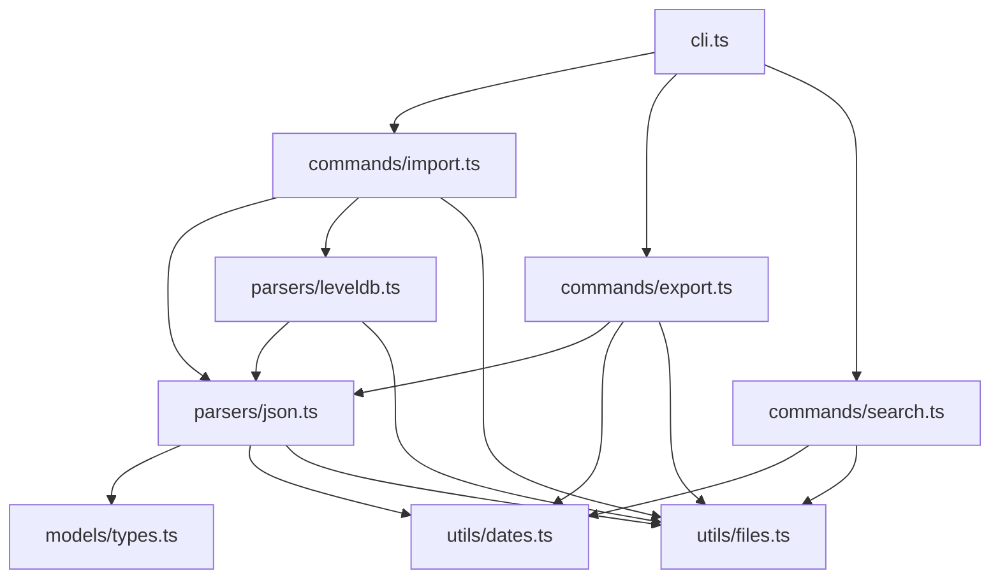

# Code Structure

## Table of Contents

- [Overview](#overview)
- [Directory Structure](#directory-structure)
- [Source Code Organization](#source-code-organization)
- [File Naming Conventions](#file-naming-conventions)
- [Module Dependencies](#module-dependencies)
- [Adding New Files](#adding-new-files)

---

## Overview

OneTab Importer follows a simple, flat module structure with clear separation of concerns:

```
src/
├── cli.ts              # Entry point - command definitions
├── commands/           # Business logic for each command
├── parsers/            # Data extraction and validation
├── models/             # Type definitions and constants
└── utils/              # Shared helper functions
```

---

## Directory Structure

### Full Project Structure

```
OneTabImporter/
├── 📁 src/                      # TypeScript source files
│   ├── 📄 cli.ts                # CLI entry point
│   ├── 📁 commands/             # Command implementations
│   │   ├── 📄 import.ts         # Import command
│   │   ├── 📄 export.ts         # Export command
│   │   └── 📄 search.ts         # Search command
│   ├── 📁 parsers/              # Data parsers
│   │   ├── 📄 json.ts           # JSON parser
│   │   └── 📄 leveldb.ts        # LevelDB parser
│   ├── 📁 models/               # Type definitions
│   │   └── 📄 types.ts          # All TypeScript interfaces
│   └── 📁 utils/                # Helper functions
│       ├── 📄 dates.ts          # Date utilities
│       └── 📄 files.ts          # File I/O utilities
├── 📁 dist/                     # Compiled JavaScript (gitignored)
├── 📁 data/                     # Data storage
│   └── 📄 master.json           # User's tab data
├── 📁 output/                   # Generated Markdown
├── 📁 scripts/                  # Utility scripts
│   └── 📄 copy-leveldb.ps1      # PowerShell copy script
├── 📁 docs/                     # Documentation
├── 📄 package.json              # Project manifest
├── 📄 tsconfig.json             # TypeScript config
├── 📄 README.md                 # Project readme
└── 📄 LICENSE                   # MIT license
```

---

## Source Code Organization

### Entry Point (`src/cli.ts`)

The CLI entry point is responsible for:
- Importing and initializing Commander.js
- Defining all available commands and their options
- Routing to command handlers
- Global error handling

```typescript
// src/cli.ts structure
import { Command } from 'commander';
import { importCommand } from './commands/import.js';
import { exportCommand } from './commands/export.js';
// ...

const program = new Command();

// Command definitions
program.command('import').action(async (opts) => importCommand(opts));
program.command('export').action(async (opts) => exportCommand(opts));
// ...

program.parse();
```

**Key patterns**:
- Each command is registered with `program.command()`
- Options are defined with `.option()`
- Async actions with error handling

### Commands (`src/commands/`)

Each command file contains:
- A main exported function (e.g., `importCommand`)
- Helper functions specific to that command
- Console output formatting

| File | Main Export | Purpose |
|------|-------------|---------|
| `import.ts` | `importCommand()` | Import from JSON or LevelDB |
| `import.ts` | `printExtractionScript()` | Print DevTools script |
| `export.ts` | `exportCommand()` | Export to Markdown |
| `export.ts` | `exportSingleFile()` | Export single consolidated file |
| `search.ts` | `searchCommand()` | Search functionality |
| `search.ts` | `listDomainsCommand()` | List domains utility |

**Example command structure**:

```typescript
// src/commands/import.ts

import chalk from 'chalk';
import { parseOneTabJson } from '../parsers/json.js';
import { readJson, writeJson } from '../utils/files.js';

export async function importCommand(options: ImportOptions): Promise<void> {
  console.log(chalk.blue('🔄 OneTab Import'));
  
  // 1. Validate options
  // 2. Load data (using parsers)
  // 3. Process data
  // 4. Save output (using utils)
  // 5. Print summary
}
```

### Parsers (`src/parsers/`)

Parsers handle data extraction and validation:

| File | Purpose | Functions |
|------|---------|-----------|
| `json.ts` | Parse OneTab JSON | `parseOneTabJson()`, `validateOneTabExport()`, `mergeMasterData()` |
| `leveldb.ts` | Read LevelDB | `parseLevelDb()`, `listLevelDbKeys()`, `dumpLevelDb()` |

**Parser responsibilities**:
- Read raw data from source
- Validate structure and types
- Transform to normalized `MasterData` format
- Handle edge cases and errors

```typescript
// src/parsers/json.ts

export function parseOneTabJson(
  rawData: unknown,
  source: MasterData['source']
): MasterData {
  // 1. Validate raw data structure
  const oneTabGroups = validateOneTabExport(rawData);
  
  // 2. Transform each group
  const groups = oneTabGroups.map(transformGroup);
  
  // 3. Calculate statistics
  // 4. Return normalized MasterData
}
```

### Models (`src/models/types.ts`)

All TypeScript interfaces and constants in one file:

**Type categories**:

```typescript
// OneTab Native Format
interface OneTabTabMeta { ... }
interface OneTabGroup { ... }
interface OneTabState { ... }

// Normalized Master Format
interface Tab { ... }
interface TabGroup { ... }
interface MasterData { ... }

// CLI Options
interface ImportOptions { ... }
interface ExportOptions { ... }
interface SearchOptions { ... }

// Search Results
interface SearchResult { ... }
interface SearchResults { ... }

// Constants
const SCHEMA_VERSION = '1.0.0';
const DEFAULT_EXTENSION_IDS = { ... };
const DEFAULT_PATHS = { ... };
```

### Utilities (`src/utils/`)

Shared helper functions used across the application:

| File | Purpose | Functions |
|------|---------|-----------|
| `dates.ts` | Date handling | `epochToIso()`, `parseFlexibleDate()`, `formatDateForHeader()`, `isDateInRange()` |
| `files.ts` | File I/O | `readJson()`, `writeJson()`, `writeText()`, `exists()`, `ensureDir()` |

**Utility design principles**:
- Pure functions where possible
- Single responsibility
- Well-typed parameters and returns
- No side effects except I/O in `files.ts`

---

## File Naming Conventions

### Source Files

| Convention | Example |
|------------|---------|
| Lowercase with hyphens | `copy-leveldb.ps1` |
| TypeScript extension | `.ts` |
| Test files (future) | `*.test.ts` or `*.spec.ts` |

### Exported Functions

| Convention | Example |
|------------|---------|
| camelCase | `importCommand`, `parseOneTabJson` |
| Verb + Noun | `readJson`, `formatDateForHeader` |
| Boolean prefix | `isDateInRange`, `isValidGroup` |

### Types and Interfaces

| Convention | Example |
|------------|---------|
| PascalCase | `MasterData`, `TabGroup` |
| Descriptive names | `SearchOptions`, `ImportOptions` |

### Constants

| Convention | Example |
|------------|---------|
| SCREAMING_SNAKE_CASE | `SCHEMA_VERSION`, `DEFAULT_PATHS` |
| Object constants | `DEFAULT_EXTENSION_IDS.edge` |

---

## Module Dependencies

### Dependency Graph



### Import Patterns

All imports use ESM syntax with `.js` extensions:

```typescript
// External packages
import { Command } from 'commander';
import chalk from 'chalk';

// Internal modules (note .js extension)
import { parseOneTabJson } from '../parsers/json.js';
import type { MasterData, ImportOptions } from '../models/types.js';
```

> ⚠️ **Important**: Always use `.js` extension for local imports, even when importing `.ts` files. TypeScript compiles to JavaScript, so the runtime needs `.js`.

---

## Adding New Files

### Adding a New Command

1. **Create the command file**:
   ```bash
   touch src/commands/mycommand.ts
   ```

2. **Implement the command**:
   ```typescript
   // src/commands/mycommand.ts
   import chalk from 'chalk';
   import type { MasterData } from '../models/types.js';
   
   export interface MyCommandOptions {
     input?: string;
     // ... options
   }
   
   export async function myCommand(options: MyCommandOptions): Promise<void> {
     console.log(chalk.blue('🔧 My Command'));
     // Implementation
   }
   ```

3. **Register in CLI**:
   ```typescript
   // src/cli.ts
   import { myCommand } from './commands/mycommand.js';
   
   program
     .command('mycommand')
     .description('Description of my command')
     .option('-o, --option <value>', 'Option description')
     .action(async (options) => {
       await myCommand(options);
     });
   ```

### Adding a New Utility Function

1. **Add to appropriate utils file** or create new file if needed:
   ```typescript
   // src/utils/strings.ts (new file)
   export function truncate(str: string, length: number): string {
     if (str.length <= length) return str;
     return str.slice(0, length - 3) + '...';
   }
   ```

2. **Import where needed**:
   ```typescript
   import { truncate } from '../utils/strings.js';
   ```

### Adding a New Type

Add to `src/models/types.ts`:

```typescript
// src/models/types.ts

// Add interface
export interface MyNewType {
  field: string;
  count: number;
}

// Add to existing interface if extending
export interface ExportOptions {
  // existing fields...
  newOption?: string;  // Add new field
}
```

---

## Related Documentation

- [Architecture](../overview/ARCHITECTURE.md) — System design overview
- [Coding Standards](./CODING_STANDARDS.md) — Style guidelines
- [Debugging](./DEBUGGING.md) — Debug techniques
