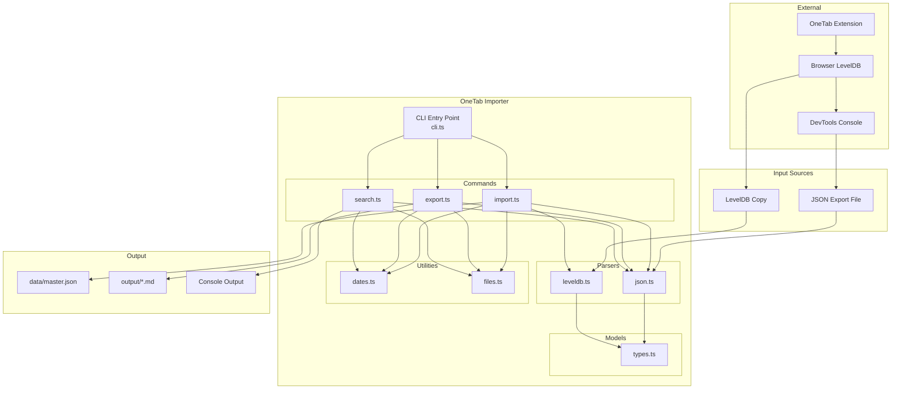
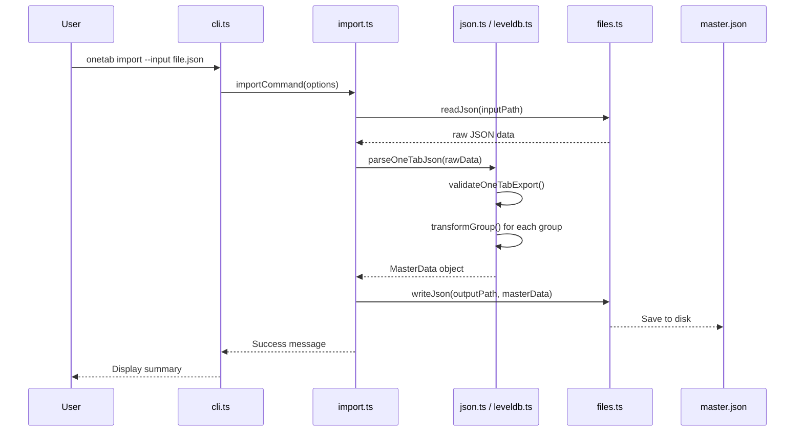
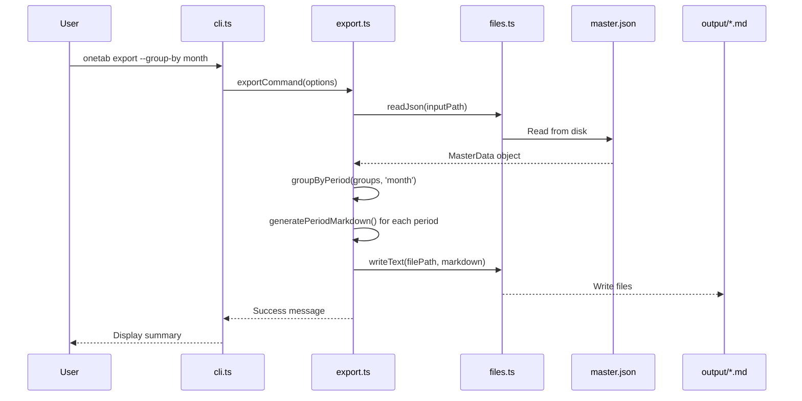
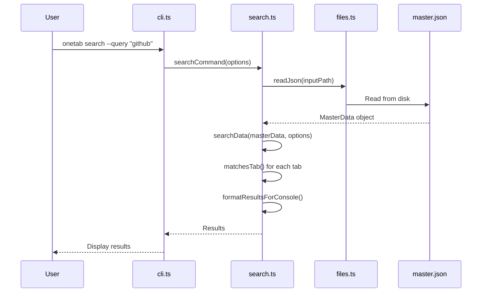

# Architecture

## Table of Contents

- [System Overview](#system-overview)
- [Component Diagram](#component-diagram)
- [Data Flow](#data-flow)
- [Module Structure](#module-structure)
- [Design Decisions](#design-decisions)
- [Data Storage](#data-storage)

---

## System Overview

OneTab Importer is a **command-line application** built with Node.js and TypeScript. It follows a simple, modular architecture with clear separation of concerns:

- **CLI Layer**: Command parsing and user interaction
- **Command Layer**: Business logic for each command
- **Parser Layer**: Data extraction and validation
- **Utility Layer**: Shared helper functions

---

## Component Diagram



---

## Data Flow

### Import Flow



### Export Flow



### Search Flow



---

## Module Structure

### Entry Point (`src/cli.ts`)

The CLI entry point uses [Commander.js](https://github.com/tj/commander.js) to:
- Define all available commands
- Parse command-line arguments
- Route to appropriate command handlers
- Handle errors with colored output

```typescript
// src/cli.ts - Command registration pattern
program
  .command('import')
  .description('Import OneTab data from JSON export or LevelDB')
  .option('-i, --input <path>', 'JSON file from DevTools export')
  .option('-l, --leveldb <path>', 'LevelDB directory path')
  .action(async (options) => {
    await importCommand(options);
  });
```

### Commands (`src/commands/`)

Each command is a self-contained module that:
- Validates input options
- Orchestrates parser and utility calls
- Produces output (files or console)
- Reports success/failure

| Command | File | Purpose |
|---------|------|---------|
| `import` | `import.ts` | Import from JSON or LevelDB to master.json |
| `export` | `export.ts` | Export master.json to Markdown files |
| `search` | `search.ts` | Search through master.json |
| `domains` | `search.ts` | List unique domains with counts |
| `script` | `import.ts` | Print DevTools extraction script |

### Parsers (`src/parsers/`)

Parsers handle data extraction and validation:

| Parser | Purpose |
|--------|---------|
| `json.ts` | Parse and validate OneTab JSON exports, transform to normalized format |
| `leveldb.ts` | Read OneTab data directly from LevelDB storage |

```typescript
// src/parsers/json.ts - Validation pattern
function isValidGroup(obj: unknown): obj is OneTabGroup {
  if (!obj || typeof obj !== 'object') return false;
  const group = obj as Record<string, unknown>;
  return (
    typeof group.id === 'string' &&
    typeof group.createDate === 'number' &&
    Array.isArray(group.tabsMeta)
  );
}
```

### Utilities (`src/utils/`)

Shared helper functions used across commands:

| Utility | Purpose |
|---------|---------|
| `dates.ts` | Date parsing, formatting, range checking |
| `files.ts` | File I/O, directory management, path helpers |

### Models (`src/models/types.ts`)

All TypeScript interfaces and constants:
- OneTab native format types
- Normalized MasterData types
- CLI option interfaces
- Search result types
- Default values and constants

---

## Design Decisions

### Why a CLI Instead of a GUI?

| Reason | Explanation |
|--------|-------------|
| **Automation** | Easy to script and schedule |
| **Simplicity** | No need for UI framework dependencies |
| **Portability** | Works in any terminal environment |
| **Developer-focused** | Target audience is comfortable with CLI |

### Why JSON as Master Format?

| Reason | Explanation |
|--------|-------------|
| **Human-readable** | Easy to inspect and debug |
| **Universal** | Can be consumed by any programming language |
| **Schema-flexible** | Easy to add new fields in future versions |
| **Version control friendly** | Can be committed to git |

### Why ISO 8601 Timestamps?

| Reason | Explanation |
|--------|-------------|
| **Standardized** | Internationally recognized format |
| **Sortable** | Lexicographic sorting works correctly |
| **Timezone-aware** | Includes timezone information (UTC) |
| **JavaScript-native** | `Date.toISOString()` produces this format |

### Why Preserve Original Epoch?

```typescript
interface TabGroup {
  createdAt: string;        // ISO 8601 for display
  createdAtEpoch: number;   // Original epoch for precision
}
```

We keep both formats because:
- ISO 8601 is human-readable
- Epoch milliseconds preserve exact original values
- Allows round-trip conversion without precision loss

---

## Data Storage

### File Locations

| Path | Purpose |
|------|---------|
| `data/master.json` | Primary data storage (normalized JSON) |
| `output/` | Generated Markdown files |
| `leveldb-copy/` | Temporary LevelDB copy (gitignored) |

### Master JSON Structure

```json
{
  "schemaVersion": "1.0.0",
  "exportedAt": "2026-02-01T10:00:00.000Z",
  "source": {
    "browser": "edge",
    "extensionId": "hoimpamkkoehapgenciaoajfkfkpgfop",
    "extractionMethod": "devtools"
  },
  "stats": {
    "totalGroups": 150,
    "totalTabs": 2500,
    "dateRange": { "earliest": "...", "latest": "..." }
  },
  "groups": [...]
}
```

> 📚 For detailed schema documentation, see [DATA_SCHEMA.md](../DATA_SCHEMA.md)

---

## Related Documentation

- [Tech Stack](./TECH_STACK.md) — Technologies used
- [Code Structure](../development/CODE_STRUCTURE.md) — Detailed file organization
- [Data Schema](../DATA_SCHEMA.md) — Complete schema documentation
