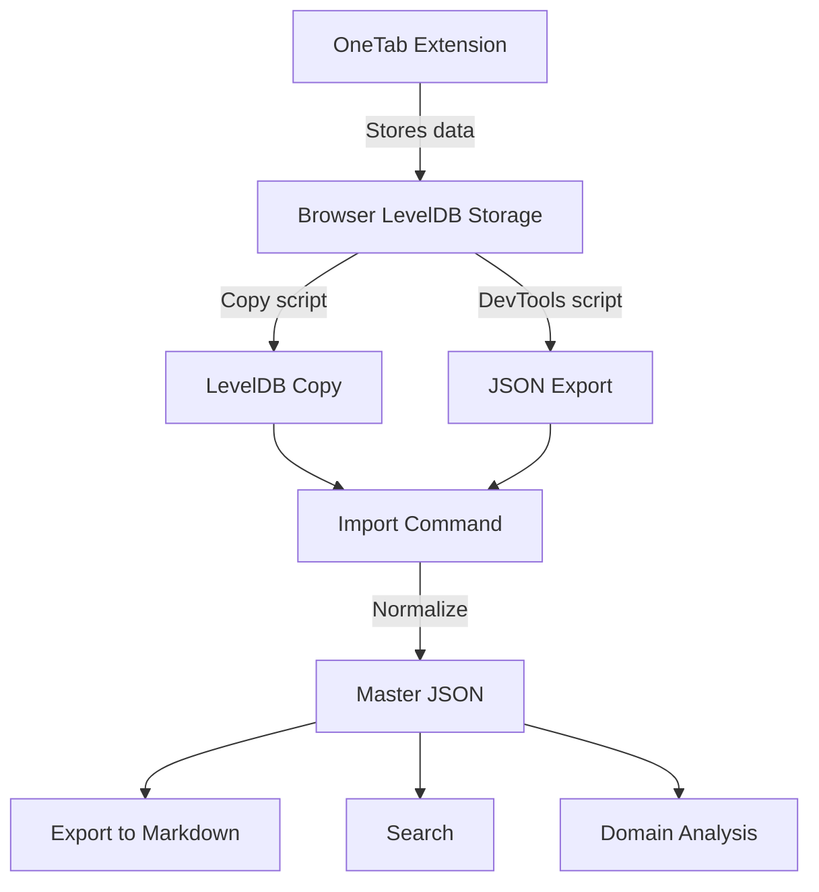

# Project Overview

## Table of Contents

- [What is OneTab Importer?](#what-is-onetab-importer)
- [The Problem](#the-problem)
- [The Solution](#the-solution)
- [Key Features](#key-features)
- [Use Cases](#use-cases)
- [How It Works](#how-it-works)
- [Limitations](#limitations)

---

## What is OneTab Importer?

**OneTab Importer** is a command-line tool that extracts, normalizes, and exports data from the [OneTab browser extension](https://www.one-tab.com/). It preserves the creation timestamps of your saved tabs and converts them into searchable JSON and human-readable Markdown formats.

---

## The Problem

OneTab is a popular browser extension that helps users manage browser tab overload by saving all open tabs as a list. While it's excellent at saving tabs, it has limitations:

1. **No native export with timestamps**: OneTab's built-in export feature produces plain text without the dates when tabs were saved
2. **Data locked in the browser**: Your tab data is stored in the browser's extension storage (LevelDB), making it inaccessible without technical knowledge
3. **No search functionality**: There's no way to search through years of saved tabs by keyword, domain, or date
4. **Risk of data loss**: If you reinstall your browser or the extension, you could lose all your saved tabs

---

## The Solution

OneTab Importer provides:

1. **Two extraction methods**:
   - **DevTools Console Export**: Run a JavaScript snippet to download your data with timestamps
   - **Direct LevelDB Copy**: Safely copy the browser's storage files for parsing

2. **Normalized JSON output**: Your tab data is converted to a clean, consistent JSON format with:
   - ISO 8601 timestamps
   - Extracted domains
   - Statistics and metadata

3. **Markdown export**: Human-readable files organized by month, week, or day

4. **Search capabilities**: Find tabs by keyword, domain, URL pattern, or date range

---

## Key Features

| Feature | Description |
|---------|-------------|
| 🕐 **Timestamp preservation** | Keeps the original creation date of each tab group |
| 📥 **Multiple import sources** | Import from DevTools JSON or directly from LevelDB |
| 📄 **JSON master format** | Normalized, searchable data with full metadata |
| 📝 **Markdown export** | Human-readable files organized by time period |
| 🔍 **Search** | Find tabs by title, URL, domain, or date range |
| 🔒 **Safe LevelDB copy** | PowerShell script to safely copy browser data |
| 🔧 **Debug utilities** | Tools to inspect LevelDB contents |

---

## Use Cases

### Personal Knowledge Management

> "I saved a great article about React hooks last year but can't find it."

```bash
npm run start -- search --query "hooks" --from 2025-01
```

### Backup and Archive

> "I want to backup all my OneTab data before reinstalling the browser."

```bash
# Export to JSON (preserves all data)
npm run start -- import --leveldb ./leveldb-copy
# Export to Markdown (human-readable archive)
npm run start -- export
```

### Domain Analysis

> "I want to see which websites I save the most."

```bash
npm run start -- domains
```

### Date-Based Browsing

> "What was I researching in January 2025?"

```bash
npm run start -- export --from 2025-01 --to 2025-01
```

---

## How It Works



### Data Flow Summary

1. **Source**: OneTab stores your tabs in the browser's LevelDB storage
2. **Extract**: Use either the DevTools console script or the LevelDB copy script
3. **Import**: The `import` command parses and normalizes the data
4. **Store**: Data is saved to `data/master.json` in a clean format
5. **Use**: Export to Markdown, search, or analyze your tabs

---

## Limitations

### What OneTab Importer Does NOT Do

- ❌ **Sync with cloud**: No cloud sync or multi-device support
- ❌ **Restore to OneTab**: Cannot push data back into the OneTab extension
- ❌ **Real-time monitoring**: No live connection to the browser
- ❌ **macOS/Linux LevelDB**: The copy script is Windows-only (but DevTools export works everywhere)
- ❌ **Firefox support**: Currently only supports Edge and Chrome

### Technical Constraints

| Constraint | Reason |
|------------|--------|
| Browser must be closed for LevelDB copy | LevelDB locks files while the browser is running |
| DevTools script requires manual execution | Browser security prevents automated access to extension storage |
| No GUI | Designed as a CLI tool for automation and scripting |

---

## Related Documentation

- [Architecture](./ARCHITECTURE.md) — How the system is designed
- [Tech Stack](./TECH_STACK.md) — Technologies used
- [Installation](../getting-started/INSTALLATION.md) — Get started
